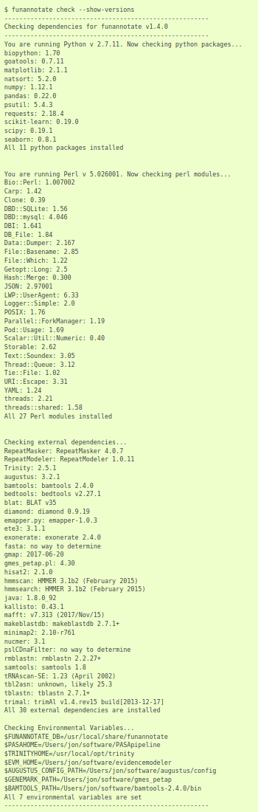

## Why use containers

- **portability**: run your analysis without installing software
- **reproducibility**: capture the software required to repeat your work

## Container software

## Use software without installing it

- example?
- don't need admin rights to install

## Use software that has a lot of dependencies

- example (probably funannotate)

`funannotate` dependencies\*

\* a subset

## Use software that needs newer libraries

- example?

## What is a container

Ultra brief, maybe show a recipe

*More information*: <a href="https://github.com/GenomicsAotearoa/Reproducible_Bioinformatics/blob/master/1.Introduction/slides.pdf">Presentation</a> by Tom Harrop at eResearch2020.
