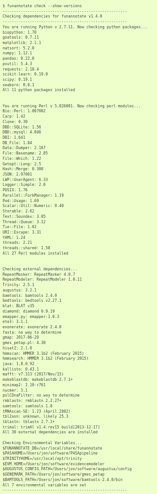

## Tutorial: genome assembly of diatom Chr 17

### Overview

- Use containers to trim and assemble some Nanopore reads from Chromosome 17 of the diatom *Thalassiosira pseudonana*
- Data and steps are from [Tim Kahlke's](https://www.uts.edu.au/staff/tim.kahlke) great [Introduction to Long-Read Data Analysis](https://timkahlke.github.io/LongRead_tutorials/).
- No software needed other than `singularity`!

### Setup

- These containers should be in the root directory.
    + `porechop_0.2.4.sif`
    + `minimap2_2.17r941.sif`
    + `miniasm_0.3r179.sif`
    + `gfatools_0.4r165`
    + `bbmap_38.76.sif`
    + `funannotate-conda_1.7.4.sif`
- Download data (`data/all_guppy.fastq`), it's stored on GH using Git LFS
- Set up a working directory

```bash
mkdir run && cd run
```

### Step 1.

The first step is to trim sequencing adaptors off the reads.
We'll also search for chimeric reads, with adaptors in the middle of the read.
We're using the [`Porechop`](https://github.com/rrwick/Porechop) package, which is deprecated, but we have a Singularity container that will continue to work no matter what OS we're on.

<!-- shub://TomHarrop/ont-containers:porechop_0.2.4 -->

```bash
singularity exec \
    ../porechop_0.2.4.sif \
    porechop \
    --check_reads 100 \
    -t 8 \
    --discard_middle \
    -i ../data/all_guppy.fastq \
    -o trimmed.fastq
```

We'll have a look at the raw reads to see what the length distribution is like.

<!-- shub://TomHarrop/seq-utils:bbmap_38.76 -->

```bash
singularity exec \
    ../bbmap_38.76.sif \
    stats.sh \
    in=trimmed.fastq
```

### Step 2.

To save time, we're not doing a full assembly of these reads.
We're using the overlap-layout-consensus steps implemented in `miniasm`.
It's not very accurate but it runs quickly.

The first step is an all-vs-all alignment with `minimap2` to work out which reads overlap.

<!-- shub://TomHarrop/singularity-containers:minimap2_2.17r941 -->

```bash
singularity exec \
    ../minimap2_2.17r941.sif \
    minimap2 \
    -x ava-ont \
    trimmed.fastq trimmed.fastq \
    | gzip -1 > minimap.paf.gz
```

Miniasm takes the aligned reads and merges the overlaps to produce "unitigs".

<!-- shub://TomHarrop/assemblers:miniasm_0.3r179 -->

```bash
singularity exec \
    ../miniasm_0.3r179.sif \
    miniasm \
    -f trimmed.fastq \
    minimap.paf.gz \
    > miniasm.gfa
```

The output is in `.gfa` (graph) format. 
We can examine it with `gfatools`.

<!-- shub://TomHarrop/assembly-utils:gfatools_0.4r165 -->

```bash
singularity exec \
    ../gfatools_0.4r165.sif \
    gfatools stat \
    miniasm.gfa
```

We can also use `gfatools` to convert the `.gfa` to `.fasta` format.

<!-- shub://TomHarrop/assembly-utils:gfatools_0.4r165 -->

```bash
singularity exec \
    ../gfatools_0.4r165.sif \
    gfatools gfa2fa \
    miniasm.gfa \
    > miniasm.fa
```

### Step 3.

A quick look at the assembly stats shows that we assembled ~ 1 MB of sequence in 11 contigs.

<!-- shub://TomHarrop/seq-utils:bbmap_38.76 -->

```bash
singularity exec \
    ../bbmap_38.76.sif \
    stats.sh \
    in=miniasm.fa
```

### Further steps

In this toy example we used software that's easy to install.
Not all software is this easy to work with.
Funannotate is a gene annotation workflow with ~74 **documented** dependencies.

<!-- shub://TomHarrop/funannotate-singularity:funannotate-conda_1.7.4 -->

```bash
singularity exec \
    ../funannotate-conda_1.7.4.sif \
    bash -c ' \
    funannotate check \
    --show-versions'
```



### Using containers with workflow managers

Example rule to run miniasm inside a singularity container:

```python3
rule miniasm:
    input:
        fq = 'output/trimmed.fastq',
        paf = 'output/minimap.paf.gz'
    output:
        'output/miniasm.gfa'
    singularity:
        # usually a URL for a container stored remotely, e.g
        # shub://TomHarrop/miniasm_0.3r176
        # docker://TomHarrop/miniasm_0.3r176
        'miniasm_0.3r179.sif'
    shell:
        'miniasm -f '
        '{input.fq} '
        '{input.paf} '
        '> {output}'
```

Run the same workflow with containers (here's a `snakemake` [`Snakefile`](Snakefile) to test):

```bash
cd ../2.Tutorial/
cp ../data/all_guppy.fastq .
ls -lhrt

snakemake --cores 8         # doesn't run because missing porechop
snakemake --cores 8 --use-singularity

singularity exec \
    ../bbmap_38.76.sif \
    stats.sh \
    in=miniasm.fa
```
