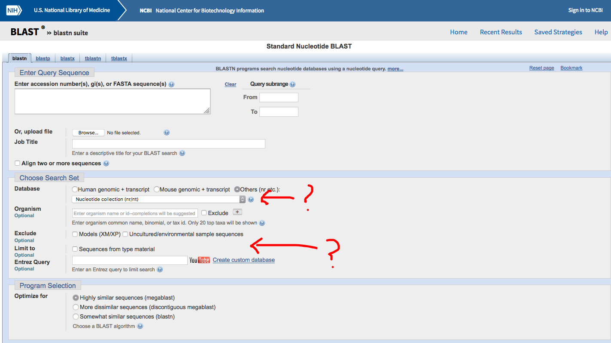
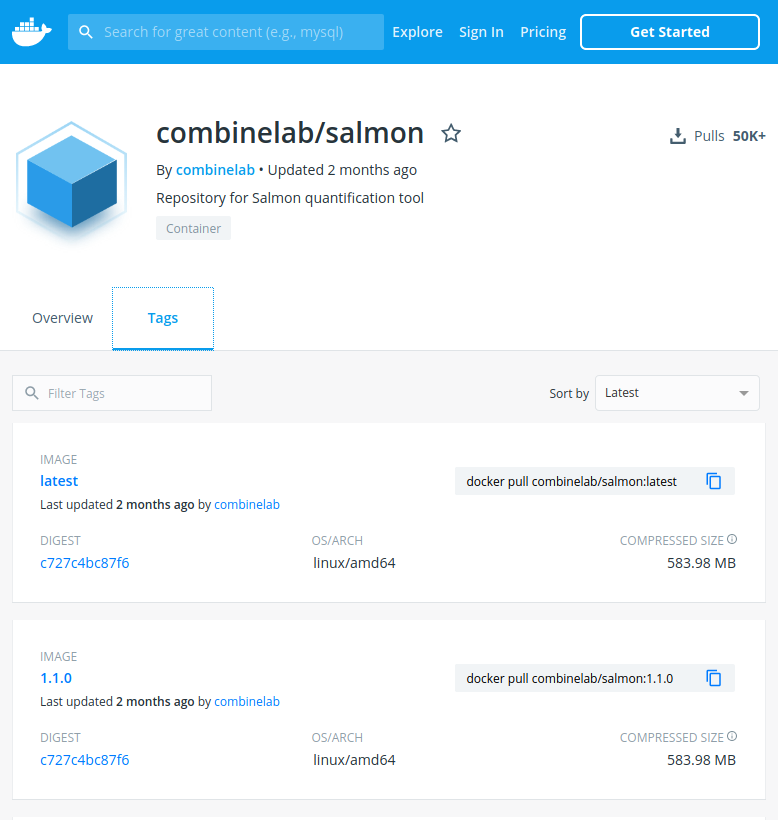
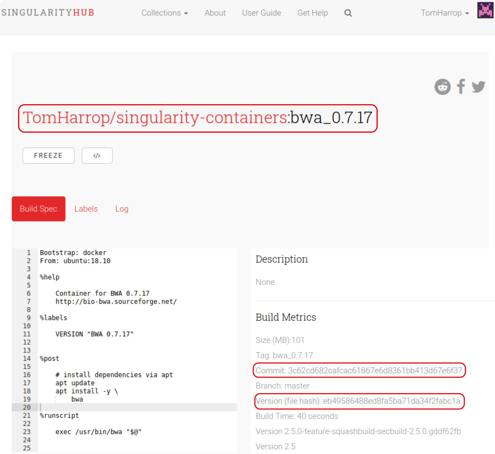

---
output:
    beamer_presentation:
        includes:
            in_header: style/header.tex
            before_body: style/body.tex
        fig_caption: false
        fig_crop: false
        latex_engine: xelatex
        highlight: tango
classoption: "aspectratio=169"
date: "2020-02-12"
---

# \hfill

\begincols[c]
\begincol{0.5\textwidth}

{height=50mm}
\endcol
\begincol{0.5\textwidth}

{height=50mm}

\endcol
\endcols

\source{Jenny Bryan \href{https://youtu.be/7oyiPBjLAWY}{https://youtu.be/7oyiPBjLAWY} \& Nature News, \href{http://www.nature.com/news/1-500-scientists-lift-the-lid-on-reproducibility-1.19970}{10.1038/533452a}}

# What is reproducibility?

**Reproduce**: under identical conditions to the previous result, repeat the analysis and get the **exact** same result

\begincols[t]
\begincol{0.5\textwidth}

In bioinformatics:

- **same data**
- **same methodology** (code)
- **same result**

\endcol
\begincol{0.5\textwidth}

Guidelines for reproducible analysis:

1. Don't modify raw data
2. Record the code
3. Capture the computing environment

\endcol
\endcols

\source{Adapted from Adam Labadorf's \href{https://bf528.readthedocs.io/en/latest/_downloads/c6a6675d4570f5ab61c8fe88cb429b8a/reproducibility.pdf}{slides}}

<!-- # 1. Take care peeking at the data -->

<!-- {height=65mm} -->

<!-- \source{Ziemann \emph{et al}., 2016. \href{https://doi.org/10.1186/s13059-016-1044-7}{10.1186/s13059-016-1044-7}} -->

<!-- # Point-and-click analysis may be hard to reproduce -->

<!-- \centering -->

<!-- {height=2.8in} -->

# Interactive analysis may be hard to reproduce

\begincols[t]
\begincol{0.5\textwidth}

**Examples**:

- install software locally
- use software installed by the admin
- paste commands from a text file into the console
- save a set of scripts to run in order

\endcol
\begincol{0.5\textwidth}

**Possible issues**:

- will it run again?
- are all the steps documented?
- is the recorded code exactly what was run?
- are the steps in the right order?

\endcol
\endcols

# Workflow managers force you to record every step

\begincols[c]
\begincol{0.75\textwidth}

**Define steps in `my_workflow.txt`**

```{r, engine = 'python', eval = FALSE, echo = TRUE, python.reticulate = FALSE}
step trim_adaptors:
    input:  'data/raw_reads/{sample}.fastq'
    output: 'output/trimmed/{sample}.fastq'
    shell:  'trim_adaptors --raw_reads={input} > {output}'

step run_assembly:
    input:  'output/trimmed/{sample}.fastq'
    output: 'output/assemblies/{sample}.fasta'
    shell:  'choice_assembler --reads={input} > {output}'
```

**Run**:

```{r engine='bash', eval=FALSE, echo=TRUE}
workflow_manager my_workflow.txt run_assembly
```

\endcol
\begincol{0.25\textwidth}


\endcol
\endcols

# Reproducibility and convenience

\begincols[c]
\begincol{0.5\textwidth}

{height=50mm}

\endcol
\begincol{0.5\textwidth}

- The code *is* the documentation
- Scale the same code to different data
- Version control → versioned results

\vspace{24pt}

**Lots of good options**:  
**`snakemake`**  :  `python3`  
**` nextflow`**  :  `java`  
**`      CWL`**  :  'vendor-neutral specification'  
**`    drake`**  :  `R`  
**`     make`**  :  DIY

\endcol
\endcols

# Reproducible computing environment

\begincols[c]
\begincol{0.6\textwidth}

Software has

- a **version**,
- other software **dependencies** (with versions)
- all with **system dependencies**

\endcol
\begincol{0.45\textwidth}

*e.g.* `DESeq2`  
`DESeq2_1.26.0`  
`Bioconductor 3.10.1`  
`libblas3 3.8.0`, `libc6 2.30`, *etc*.

\endcol
\endcols

\source{Adapted from Adam Labadorf's \href{https://bf528.readthedocs.io/en/latest/_downloads/c6a6675d4570f5ab61c8fe88cb429b8a/reproducibility.pdf}{slides}}

<!-- # 3. Reproducible computing environment

**On our department's hardware**:

```{r, engine = 'bash', eval = FALSE, echo = TRUE}
salmon --version
```

`salmon 0.9.1`

***e.g.* Ubuntu 19.10**:

```{r, engine = 'bash', eval = FALSE, echo = TRUE, cache = FALSE, error = TRUE, comment = NA, warn = FALSE}
apt policy salmon
```

```{r, engine = 'bash', eval = TRUE, echo = FALSE, cache = FALSE, error = TRUE, comment = NA, warn = FALSE}
apt policy salmon 2> /dev/null | tail -n 6
```
 -->

# Software containers

\begincols[c]
\begincol{0.6\textwidth}

- Isolated, complete environment (a mini OS)
- Contain specific version of software with dependencies
- Mobility of compute
- Reproducibility
- `Singularity` can run on traditional HPC

\endcol
\begincol{0.4\textwidth}

{height=30mm}

{height=30mm}

\endcol
\endcols

\source{\href{https://sylabs.io/guides/3.5/user-guide/introduction.html}{sylabs.io}}

<!-- # 3. Singularity containers

**Running directly**:

```{r, engine = 'bash', eval = FALSE, echo = TRUE, cache = FALSE, error = TRUE, comment = NA}
salmon --help
```

`Command 'salmon' not found, but can be installed with:`  
`sudo apt install salmon`

**Running with Singularity**:

```{r, engine = 'bash', eval = FALSE, echo = TRUE, cache = FALSE, error = TRUE, comment = NA}
singularity exec salmon_1.1.0.sif \
  salmon --help
```

```{r, engine = 'bash', eval = TRUE, echo = FALSE, cache = FALSE, error = TRUE, comment = NA}
singularity exec salmon_1.1.0.sif salmon --help | head -n 6 | tail -n 4
``` 
-->

# Getting software in containers

\begincols[c]
\begincol{0.6\textwidth}

- Some developers provide docker containers

```{r, engine = 'bash', eval = FALSE, echo = TRUE}
singularity pull \
    --name salmon_1.1.0.sif \
    docker://combinelab/salmon:1.1.0
```

\endcol
\begincol{0.4\textwidth}

{height=60mm}

\endcol
\endcols

\source{\href{https://hub.docker.com/r/combinelab/salmon/tags}{hub.docker.com}}

# Getting software into containers

\begincols[c]
\begincol{0.5\textwidth}

- Often have to build our own containers

\bigskip

**`Singularity.bwa_0.7.17`**

```{r, engine = 'bash', eval = FALSE, echo = TRUE}
Bootstrap: docker
From: ubuntu:18.10

%labels
    VERSION "BWA 0.7.17"
%post
    apt-get update
    apt-get install -y bwa
%runscript
    exec /usr/bin/bwa "$@"
```

\endcol
\begincol{0.5\textwidth}

{height=60mm}

\endcol
\endcols

\source{\href{https://singularity-hub.org/containers/7300}{singularity-hub.org}}

# Workflow managers support containers

```{r, engine = 'python', eval = FALSE, echo = TRUE, python.reticulate = FALSE}
step trim_adaptors:
    input:          'data/raw_reads/{sample}.fastq'
    output:         'output/trimmed/{sample}.fastq'
    singularity:    'docker://my_repos/trim_adaptors:2.9'
    shell:          'trim_adaptors --raw_reads={input} > {output}'

step run_assembly:
    input:           'output/trimmed/{sample}.fastq'
    output:          'output/assemblies/{sample}.fasta'
    singularity:     'shub://my_repos/choice_assembler:1.5'
    shell:           'choice_assembler --reads={input} > {output}'
```

# Some barriers to container usage

- **Building containers can be painful** if the dependencies are disorganised
- **Duplication of effort**
- **Some software shouldn't go in a container**
because of "unfortunate licensing issues"  
  - DTU software *e.g.* `rnammer`, `tmhmm`  
  - GATech: `GeneMark` 
  - GIRInst's `RepBase`
- **Getting `Singularity` installed**

\source{See the DTU's license \href{http://www.cbs.dtu.dk/cgi-bin/sw_request?rnammer}{here}}


<!-- **Cluster execution**, *e.g.*:

```{r, engine = 'bash', eval = FALSE, echo = TRUE}
snakemake --drmaa " -q username" -j 32
```
 -->

# Reproducible analysis stack

\begincols[t]
\begincol{0.4\textwidth}

**Guidelines**:

1. Don't modify raw data
2. Record the code  
(with version control)
3. Capture the computing environment

\endcol
\begincol{0.6\textwidth}

**Stack**:

  `md5sum raw_reads.fastq`? `chmod 444`?   
  + Workflow manager (`snakemake`, `nextflow`)  
  + VCS (`git`)  
  + Software containers (`Singularity`)

\endcol
\endcols

<!-- {height=25mm} -->

<!-- \source{\href{https://snakemake.readthedocs.io/en/stable/project_info/faq.html}{snakemake.readthedocs.io}} -->

# Getting started

\begincols[t]
\begincol{0.45\textwidth}

**Reproducibility for bioinformatics**:

- Joep de Ligt: *Scalable workflows and reproducible data analysis for genomics*
- plenty of online talks e.g. [Adam Labadorf](https://bf528.readthedocs.io/en/latest/content/15_replicability_vs_reproducibility_strategies/replicability_vs_reproducibility_strategies.html#lectures) of Boston Uni

**Workflow managers**:

- [Snakemake Tutorial](https://snakemake.readthedocs.io/en/stable/tutorial/tutorial.html)
- Nextflow: [Get started](https://www.nextflow.io/docs/latest/getstarted.html)

\endcol
\begincol{0.45\textwidth}

**Software containers**:

- Blair Bethwaite: *Containers in HPC* Tutorial
- Singularity [Quick Start](https://sylabs.io/guides/3.5/user-guide/quick_start.html)

**Version control**:

- memorise a handful of `git` commands

\endcol
\endcols

\source{These slides: \href{https://github.com/TomHarrop/eresearch2020}{https://github.com/TomHarrop/eresearch2020}}